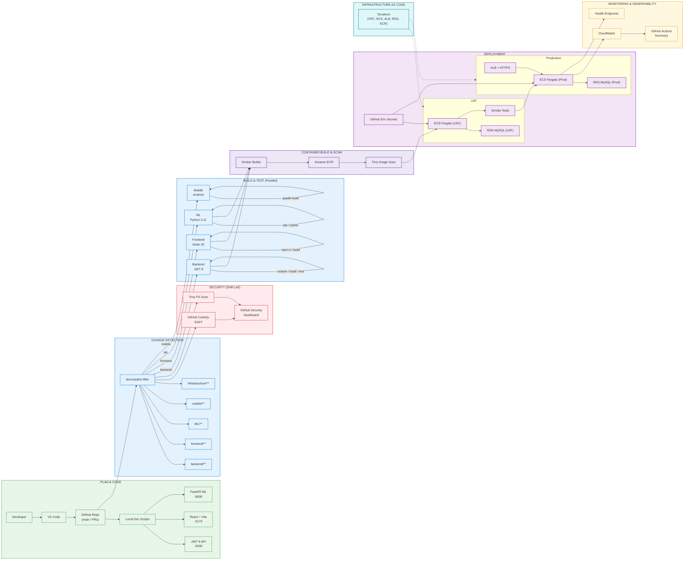

# SmartSusChef - DevSecOps Toolchain Architecture

*Shift-Left Security | Automated CI/CD | 3-Layer Monolith and ML Service Deployment*

## Legend

| Color | Phase |
|-------|-------|
| 🟢 Green | Plan & Code |
| 🔴 Red | Security Scanning |
| 🔵 Blue | Build & Test |
| 🟣 Purple | Container & Image Scan |
| 🟣 Pink | Deployment |
| 🔷 Cyan | Infrastructure as Code |
| 🟡 Yellow | Monitoring |

## Key DevSecOps Practices

- **Shift-left**: CodeQL SAST on every push
- **Supply chain**: Trivy filesystem + image scans
- **Secrets**: GitHub Environment Secrets (not in code)
- **HTTPS enforced**: TLS 1.3, HTTP→HTTPS redirect
- **Least privilege**: ECS SG port-restricted
- **Selective CI**: path-based change detection
- **Parallel deploy**: 3 ECS services simultaneously
